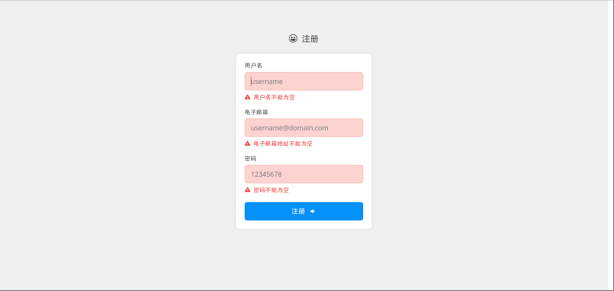
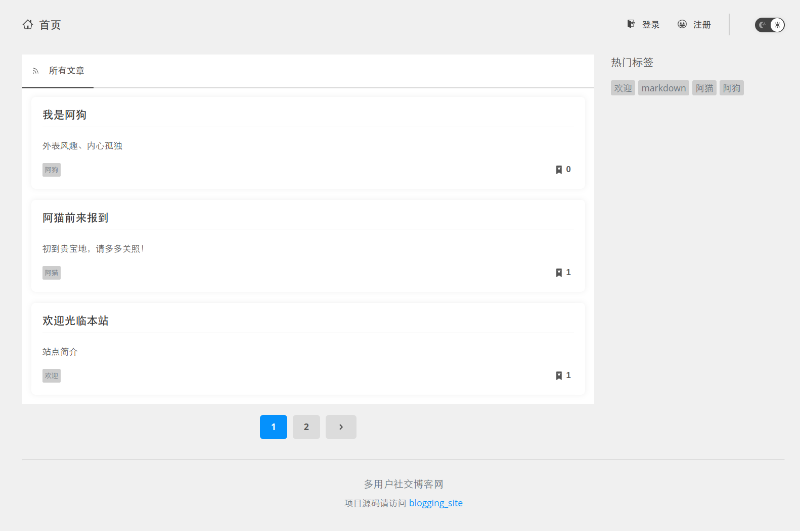
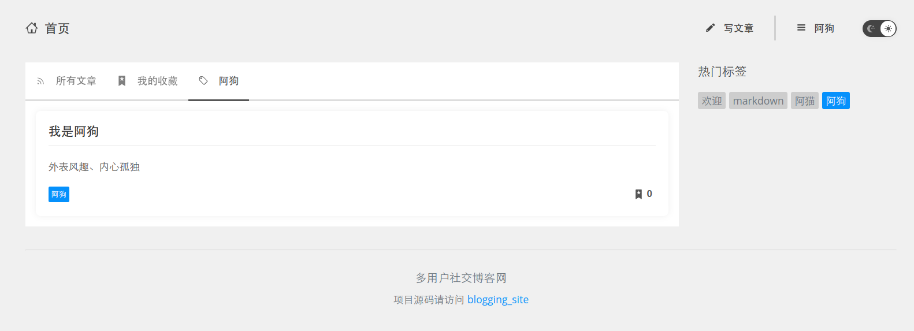
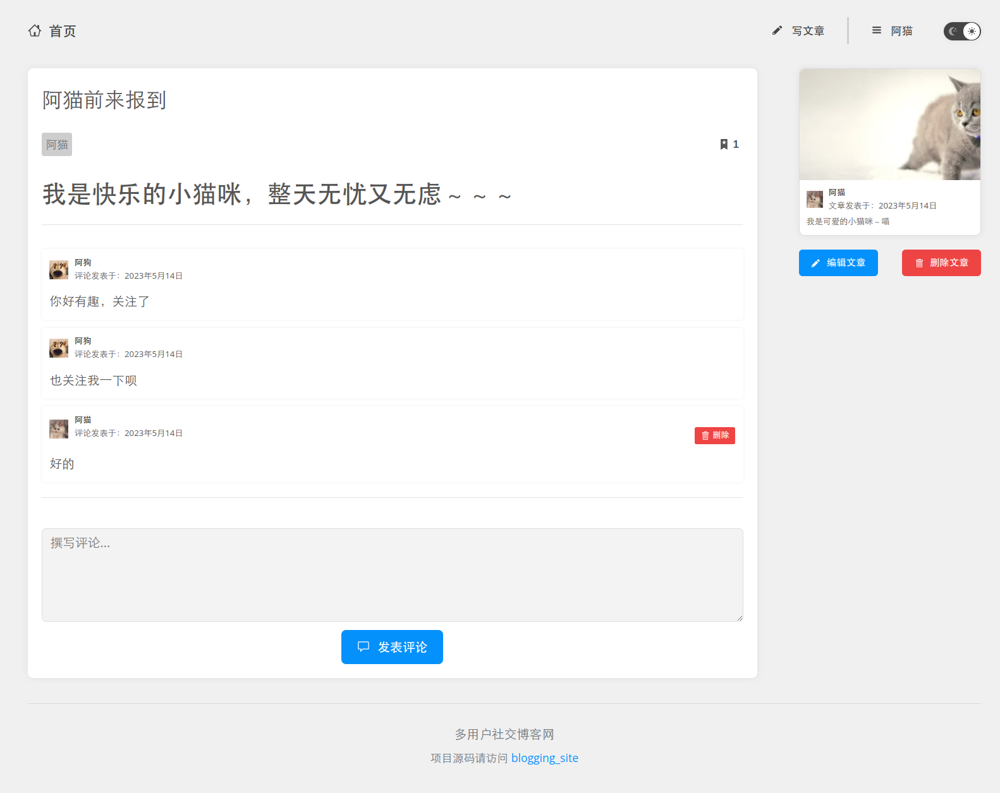
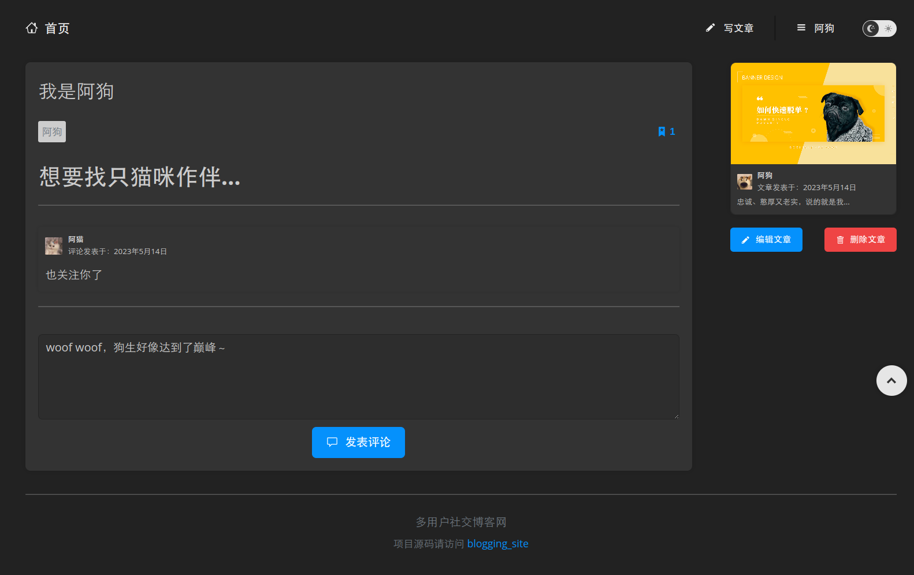
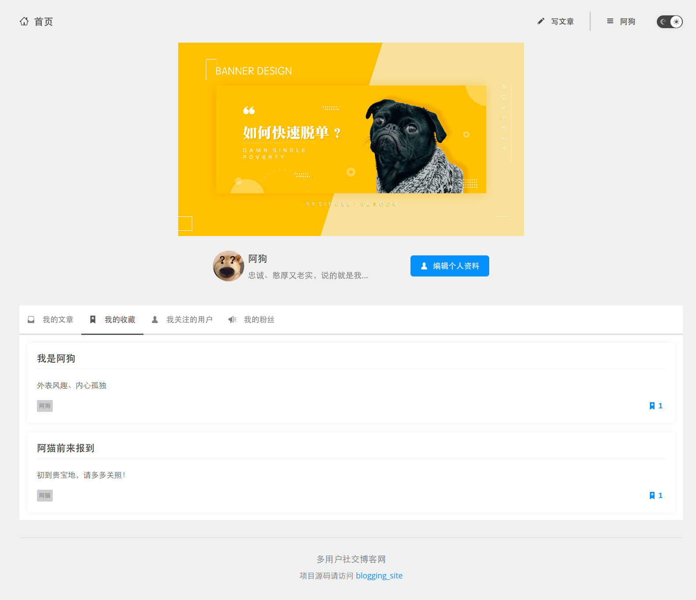
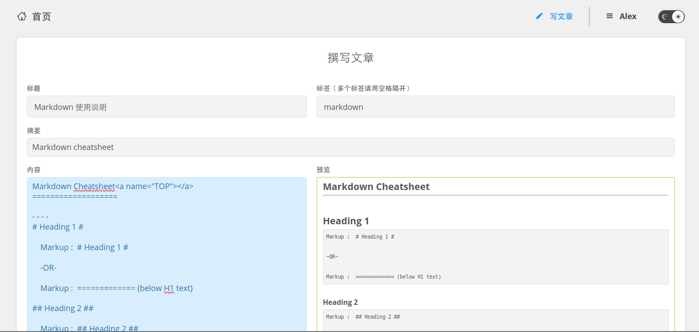

# 简介

`blogging_site` 是一个前后端（mint + go）分离的多用户社交博客网站。

# 功能

- 访客/用户登录（使用 JWT 对用户进行身份验证）
- CRU 用户
- CRUD 文章
- CRD 文章评论
- 分页显示文章/用户列表
- 文章支持标签分类
- 收藏/取消收藏文章
- 关注/取消关注用户
- 以 Markdown 格式编辑（支持预览）和显示文章
- 前后端都做了表单合法性检查
- 消息通知
- 提供深浅两套界面主题

# 截图

注册页面：

访客主页：

使用标签筛选文章：

文章页面（浅色主题）：

文章页面（深色主题）：

用户个人主页：

撰写文章页面：

# 使用说明

    git clone https://github.com/Athlon64/blogging_site
    cd blogging_site/blogging_site_backend
    go run .

打开浏览器，访问 `http://localhost:5000`。

## 其他说明：

`blogging_site_frontend` 为前端源码目录，`blogging_site_backend` 为后端源码目录。

`blogging_site_frontend/dist` 里面是前端编译后的 js、css 等文件，您可以使用该目录按自己惯用的方法搭建前端网站并访问后端（后端已做跨域处理）。为方便起见，本后端也提供对前端界面的访问，如果遇到显示不正常的情况，请按 Ctrl + F5 强制刷新浏览器缓存。

为便于测试，数据库中预填了一些数据：

<table border="2" cellspacing="0" cellpadding="6" rules="groups" frame="hsides">

<colgroup>
<col  class="org-left" />

<col  class="org-left" />

<col  class="org-left" />
</colgroup>
<thead>
<tr>
<th scope="col" class="org-left">用户名</th>
<th scope="col" class="org-left">邮箱</th>
<th scope="col" class="org-left">密码</th>
</tr>
</thead>

<tbody>
<tr>
<td class="org-left">Alex</td>
<td class="org-left">Alex@alex.com</td>
<td class="org-left">alex</td>
</tr>

<tr>
<td class="org-left">阿猫</td>
<td class="org-left">miao@miao.com</td>
<td class="org-left">miao</td>
</tr>

<tr>
<td class="org-left">阿狗</td>
<td class="org-left">wang@wang.com</td>
<td class="org-left">wang</td>
</tr>
</tbody>
</table>
